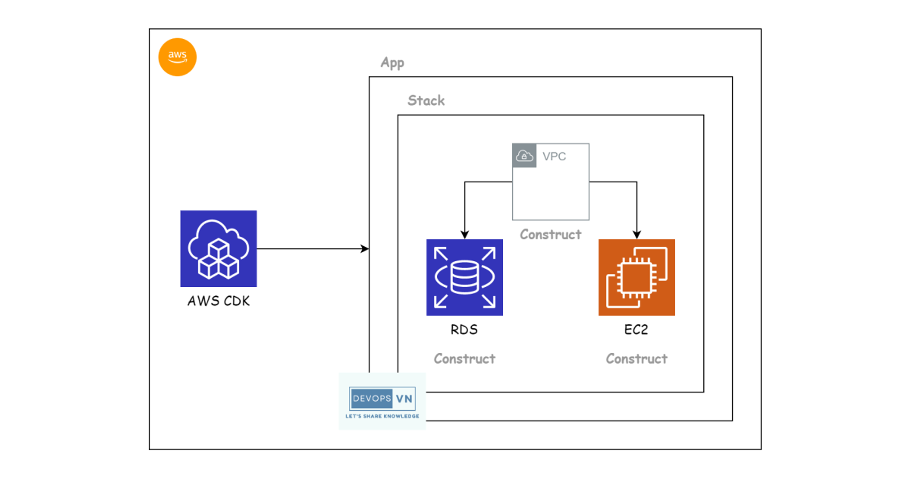

## 1. What arre the core AWS services that you are familiar with ?

Some of the core AWS service that I am familiar wiht include:

- `Amazon Elastic Compute Cloud (EC2)` - EC2 is a web service that provides secure, resizable compute capacity in the clod - It is designed to make it easy for developers to deploy application

- `Amazon Elastic Block Store (EBS)` - EBS is a bloc kstorage that provides persistent storage for EC2 instances. EBS volume can be attached to any EC2 instance and can be used to store operating system, DB and other application data.
- `Amazon Elastic File System (EFS)` - EFS provides scalable, elatic file torage for EC2 instances and on-premises resource. EFS can be used to store any type of file, including datasets, media, file and application code.
- `Amazon Simple Storage Service (S3)` - S3 is an object storage that can be scalability, data availability, security and performance. S3 is designed to store and retrieve any amount of data? at any time, anywhere on the web...
- `Amazon Virtual Private Cloud (VPC)` - VPC is a networking service that enables to ceate a private network in the cloud. VPCs allows to isolate sesources from other AWS accounr and from the public internet 
- `Amazon Route 53` - Route 53 is high scalable and available domain name system (DNS) web service. Route 53 can help you to direct web traffic to your websites and applications hosted on AWS or on-premises resources.

## 2. Can you briedly explain the difference between EC2, EBS and EFS?

EC2 is compute service while EBS and EFS is storage service.
EC2 instances are ephemeral, meaning that they are terminated when they are stopped. EBS and EFS volumes are persistent, meaning that they are not terminated when the EC2 instance to which they are attached is stopped.

EBS is a block storage service, which means that it provides block devices that can be attached to EC2 instances. EFS is a file storage service, which means that it provides a file system that can be mounted by EC2 instances.

## 3. What is S3 ? How is it used ?

S3 is an object storage that can be scalability, data availability, security and performance. S3 is designed to store and retrieve any amount of data at any time, anywhere on the web...

S3 is used for a wide variety of purposes, including:

- Web hosting
- Static site hosting
- Media storage
- Data backup and archiving
- Disaster recovery
- Application development

## 4. What is VPC and how do you use it to isolate your resources ?

VPC is a networking service that enables you to create a private network in the cloud. VPCs allow you to isolate your resources form other AWS account and public internet.

To isolate resources in a VPC:
- Security group - security froup allow to control inbound and outbound traffic to your EC2 instances.
- Network access control lists (NACLs) - control inbound and outbound traffic at the subnet level
- Route Table - control how traffic flows within VPC and internet.

## `How does EC2 communicate with S3 ?`
- EC2 and S3 are both services provided by AWS. They can be deployed in the same VPC (Virtual Private Network) to allow communication with each other.
- EC2 instances are assigned private IP addresses within the VPC. S3 is connected to the VPC through an endpoint.
- To access the S3 bucket, applications running on EC2 need to use the AWS SDK. The SDK handles connecting and communicating with the S3 service.
- The SDK will encapsulate application requests as API calls to the S3 endpoint in the VPC. It handles the encryption and decryption of data.
- The S3 endpoint will route API calls to the S3 service and return a response. The response is passed back to the EC2 application through VPC.
- IAM roles and security groups are used to control access and communication between EC2 and S3.

## `How does EC2 communicate with RDS ?`

- EC2 and RDS can be deployed in the same VPC (Virtual Private Network) to allow them to communicate with each other.
- EC2 instances are assigned private IP addresses within the VPC. RDS is assigned an endpoint in the VPC to allow connections.
- Applications running on EC2 can access RDS via TCP/IP using database connectivity libraries such as JDBC for Java or MySQLdb for Python.
- Connecting to an RDS database requires a username, password, and an endpoint provided when the RDS instance is created.
- Security groups are used to open ports and allow traffic from EC2 to the RDS database. The EC2 security group needs to allow RDS security group traffic.
- The connection is SSL encrypted to secure data transmitted between EC2 and RDS.
- IAM roles regulate access to RDS resources from the EC2 side.

## 5. What is route 53 and how do you use it to manage your DNS records ?

# AWS CDK:
### 1. Introduce about AWS CDK:
- AWS Cloud Development Kit is a Framework that is developed by AWS to define cloud infrastructure using popular programming languages such as TypeScript, JS, Python, Java, Go...ect...
- It provides a highly abstracted approach, allowing developers to leverange their existing programming skills to deploy infrastructure.
- I used AWS CDK to automate the deployment of a microservices system, including setting up VPCs, RDS, EKS, EC2 and related services.

### 2. Architecture of AWS CDK
#### 2.1. Contruct
- It's the coẻ of AWS CDK. A Construct can represent a AWS specific resource. (S3, EC2 ...), or collection of resource or more complex.
- Construct level:
    - L1: Low level - Direct representation of CloudFormation resource
    - L2: High level - provides a higher abstraction, including default logic and ease of use setting
    - L3: Patterns - Combines mutiple L1 and L2 Construct to provide comprehensive solusion, such as wweb application models.

#### 2.2. CDK App and Stack

- `CDK Stack:` Stack is a collection of related resources. It equals a stack in CloudFormation, it contains one or more Constructs
- `CDK App:`It contains one or more stacks, it is the identifier for an application

#### 2.3. CDK Toolkit
CDK Toolkit là công cụ dòng lệnh (CLI) mà bạn sử dụng để tương tác với CDK App. Nó cung cấp các lệnh để triển khai (deploy), quản lý sự khác biệt (diff), và các hành động khác với stacks của bạn.

#### 2.4. Synthesis
Quá trình Synthesis trong CDK chuyển đổi mã CDK thành template CloudFormation. Điều này xảy ra khi bạn chạy lệnh cdk deploy. CDK App của bạn sẽ được "synthesize" thành một hoặc nhiều template CloudFormation, mô tả toàn bộ cấu hình cơ sở hạ tầng của bạn.

#### 2.5. CDK Libraries
AWS CDK bao gồm một thư viện phong phú của Constructs đã được xây dựng sẵn, cho phép tái sử dụng và chia sẻ cấu hình cơ sở hạ tầng một cách dễ dàng.

### 3. So sánh với AWS CloudFormation
AWS CDK và AWS CloudFormation đều là IaC, tuy nhiên CloudFormation thì sử dụng các template YAML or JSON, trong khi CDK cho phép sử dụng các ngôn ngữ lập trình. CDK có khả năng trừu tượng hoá cao hơn, có thể thái sử dụng code và quản lý tài nguyên một cách dễ dàng hơn.