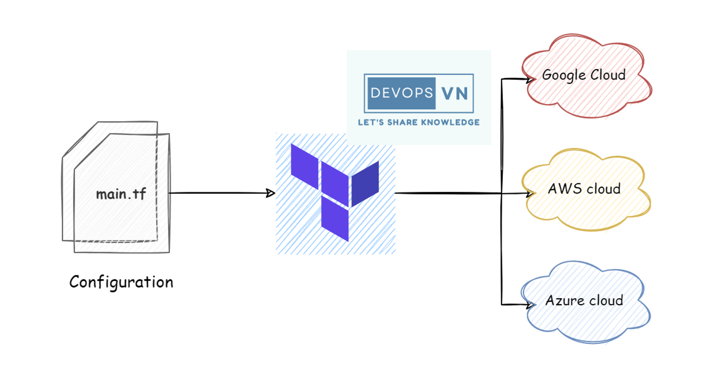

# Ansible

**Câu hỏi 1: Ansible là gì?**

**Trả lời:**

Ansible là một công cụ tự động hóa mã nguồn mở, được sử dụng để quản lý cấu hình và triển khai ứng dụng trên các máy chủ và thiết bị. Ansible sử dụng mô hình `agentless`, có nghĩa là nó `không cần cài đặt bất kỳ phần mềm bổ sung nào trên các máy chủ mục tiêu`.

Ansible có một số ưu điểm, bao gồm:

* **Dễ học và sử dụng:** Ansible sử dụng ngôn ngữ YAML đơn giản và dễ hiểu, giúp người dùng dễ dàng tạo và quản lý các playbook.

* **Có thể triển khai trên quy mô lớn:** Ansible có thể được sử dụng để quản lý hàng nghìn máy chủ và thiết bị.

* **Hỗ trợ nhiều hệ điều hành và thiết bị:** Ansible hỗ trợ nhiều hệ điều hành và thiết bị phổ biến, bao gồm Linux, Windows, macOS, và các thiết bị mạng.

* **An toàn và bảo mật:** Ansible sử dụng giao thức SSH để kết nối với các máy chủ mục tiêu, giúp bảo mật các kết nối.

Ansible có một số nhược điểm, bao gồm:

* **Có thể chậm hơn các công cụ tự động hóa khác:** Ansible sử dụng mô hình agentless, có thể khiến tốc độ thực thi các tác vụ chậm hơn.

* **Không hỗ trợ các tác vụ phức tạp:** Ansible không hỗ trợ các tác vụ phức tạp như quản lý cơ sở dữ liệu hoặc xử lý dữ liệu.

**Kiến thức chuyên môn:**

Ansible được sử dụng phổ biến trong các tổ chức quy mô lớn, nơi cần quản lý nhiều máy chủ và thiết bị. Ansible cũng được sử dụng trong các môi trường đám mây, nơi các máy chủ và thiết bị thường xuyên thay đổi.

**Câu hỏi 2: Các thành phần chính của Ansible là gì?**

**Trả lời:**

Ansible có bốn thành phần chính:

* **Ansible Controller:** Là máy chủ quản lý Ansible. Ansible Controller chịu trách nhiệm kết nối với các máy chủ mục tiêu và thực thi các tác vụ tự động hóa.
* **Ansible Inventory:** Là tập hợp các thông tin về các máy chủ mục tiêu. Ansible Inventory bao gồm tên của các máy chủ, địa chỉ IP và thông tin đăng nhập.
* **Ansible Playbook:** Là tập hợp các lệnh và biến được sử dụng để tự động hóa các tác vụ.
* **Ansible Modules:** Là các thư viện mã được sử dụng để thực hiện các tác vụ cụ thể.

**Kiến thức chuyên môn:**

Ansible Controller là thành phần quan trọng nhất của Ansible. Ansible Controller chịu trách nhiệm thực thi các playbook và quản lý các máy chủ mục tiêu.

Ansible Inventory là một tệp văn bản có chứa thông tin về các máy chủ mục tiêu. Ansible Inventory bao gồm tên của các máy chủ, địa chỉ IP và thông tin đăng nhập.

Ansible Playbook là một tập hợp các lệnh và biến được sử dụng để tự động hóa các tác vụ. Ansible Playbook được viết bằng ngôn ngữ YAML.

Ansible Modules là các thư viện mã được sử dụng để thực hiện các tác vụ cụ thể. Ansible Modules có thể được sử dụng để cài đặt phần mềm, quản lý dịch vụ và thực hiện các tác vụ khác.

**Câu hỏi 3: Các loại playbook Ansible là gì?**

**Trả lời:**

Ansible có hai loại playbook chính:

* **Playbook đơn giản:** Là playbook chỉ thực hiện một tác vụ duy nhất.
* **Playbook phức tạp:** Là playbook thực hiện nhiều tác vụ và có thể sử dụng vòng lặp, điều kiện và ngoại lệ.

**Kiến thức chuyên môn:**

Playbook đơn giản là loại playbook phổ biến nhất. Playbook đơn giản thường được sử dụng để thực hiện các tác vụ đơn giản, chẳng hạn như cài đặt phần mềm hoặc thay đổi cấu hình.

Playbook phức tạp được sử dụng để thực hiện các tác vụ phức tạp hơn. Playbook phức tạp có thể sử dụng vòng lặp, điều kiện và ngoại lệ để thực hiện các chuỗi tác vụ phức tạp.

**Câu hỏi 4: Cách viết playbook Ansible là gì?**

**Trả lời:**

Playbook Ansible được viết bằng ngôn ngữ YAML. YAML là một ngôn ngữ định dạng dữ liệu đơn giản và dễ đọc.

Cấu trúc cơ bản của playbook Ansible như sau:

```yaml
---
- hosts: all
  tasks:
    - name: Install Apache
      apt:
        name: apache2
        state: present
```

Trong ví dụ này, playbook sẽ cài đặt gói Apache trên tất cả các máy chủ được liệt

# Terraform




Terraform được phát triển bởi HashiCorp, chuyên dùng để cung cấp Infrastructure, ta chỉ việc viết code, rồi gõ một vài câu lệnh đơn giản, nó sẽ tạo ra Infrastructure cho ta, thay vì ta với lên Web Console bấm bấm rất tốn thời gian.

Luồng của Terraform sẽ như sau, `ta viết code, xong ta gõ câu lệnh, và đợi Terraform cung cấp Infrastructure, sau khi Terraform tạo xong thì nó sẽ tạo ra một tệp tin được gọi là Terraform State để lưu lại kiến trúc hạ tầng hiện tại`.

Ansible là một công cụ phục vụ cho việc Configuration, chứ nó không được tạo ra để tập trung cho mảng IaC, nên ta dùng Ansible thì sẽ tốn công chạy những thứ không cần thiết.

