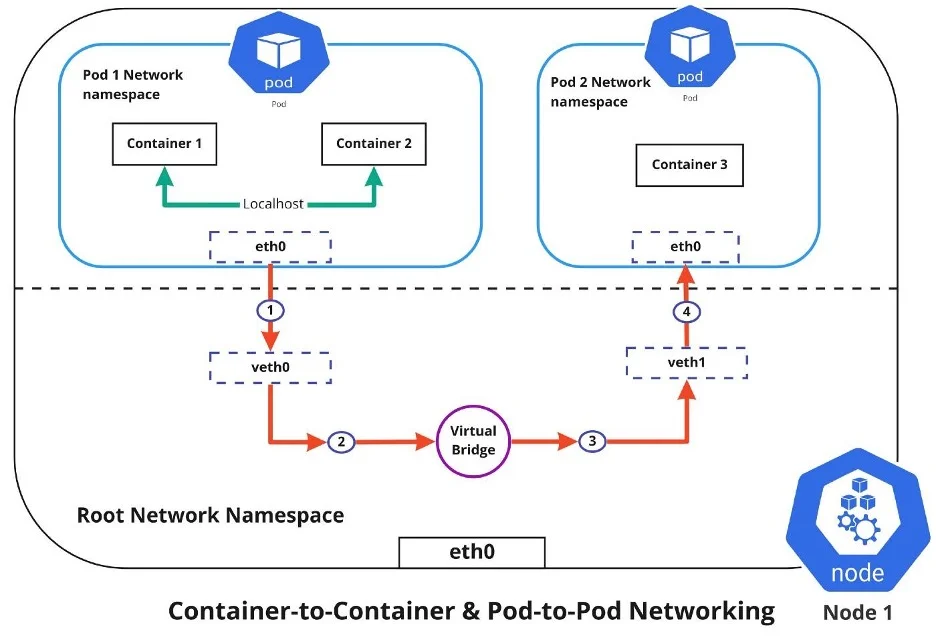
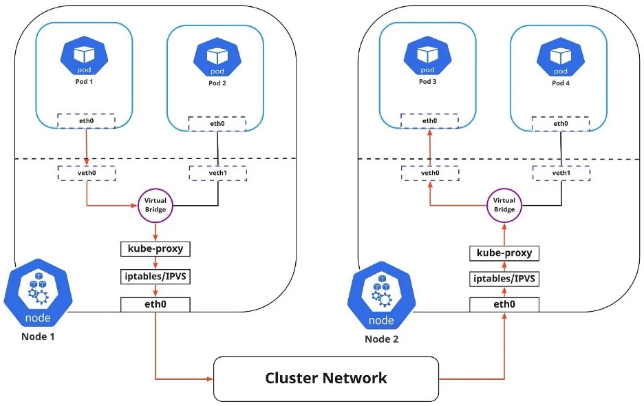
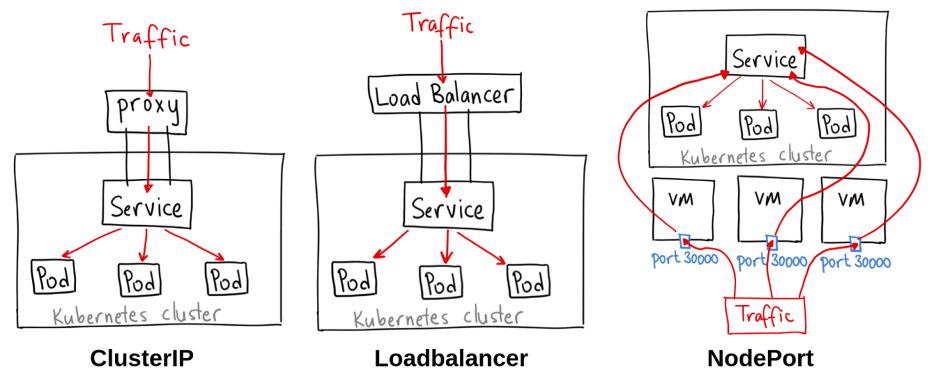

## 0. Object trong K8S
Một số loại object phổ biến trong Kubernetes (K8s) bao gồm:

- Pods - đơn vị cơ bản nhất trong K8s, bao gồm một hoặc nhiều container.
- ReplicaSets - định nghĩa một pod Pods, đảm bảo số lượng pod như mong muốn. 
- Deployments - cung cấp cách thức triển khai và cập nhật ứng dụng, quản lý ReplicaSets.
- StatefulSets - giống Deployment nhưng dành cho stateful applications.
- DaemonSets - chạy pod trên mỗi node trong cluster.
- Jobs - tạo các pod chạy một lần để hoàn thành task. 
- CronJobs - tạo Jobs theo lịch trình.
- Services - cung cấp địa chỉ mạng ổn định cho các pod, gồm ClusterIP, NodePort và LoadBalancer.
- Ingress - định tuyến lưu lượng vào cluster.
- ConfigMaps, Secrets - lưu trữ cấu hình và dữ liệu nhạy cảm.
- PersistentVolumes, PersistentVolumeClaims - cung cấp storage tồn tại độc lập với vòng đời pod.
- Namespaces - phân chia tài nguyên trong cluster. 

## 1. DaemonSet

- DaemonSet là một kiểu Kubernetes controller giúp triển khai các pod lên tất cả (hoặc một số) node trong cluster.

- Khi tạo một DaemonSet, Kubernetes sẽ tự động triển khai pod lên mỗi node mới thêm vào cluster. Nếu xóa một node khỏi cluster, các pod của DaemonSet trên node đó cũng sẽ tự động bị xóa.

- DaemonSet thường được sử dụng cho các tác vụ như log collection, monitoring, etc. Các ứng dụng này cần chạy trên mỗi node chứ không phải trên một node cụ thể.

- Một số đặc điểm của DaemonSet:
     - Chạy một pod trên mỗi node
     - Cung cấp cơ chế tự động heal khi có thay đổi về số lượng node
     - Hỗ trợ cập nhật kiểu rolling-update
     - Có thể chỉ định node nào được triển khai pod

## 2. Deployment

Deployment là một resource quan trọng trong Kubernetes (K8s) dùng để deploy và quản lý các ứng dụng.

Một số đặc điểm chính của Deployment:

- Tạo và quản lý các replica của ứng dụng dưới dạng các Pod.
- Cung cấp khả năng mở rộng, cân bằng tải và self-healing cho ứng dụng.
- Có thể tạo và cập nhật mới phiên bản ứng dụng mà không downtime.
- Hỗ trợ nhiều chiến lược triển khai như rolling update, blue/green, canary,...
- Hỗ trợ rollback để quay lại phiên bản trước đó nếu cần.
- Lưu trữ lịch sử triển khai và cho phép quay lại bất kỳ phiên bản nào. 
- Cho phép tùy chỉnh nhiều tham số như số lượng replica, resource limit, health check,..
- Tích hợp với các công cụ CI/CD như Jenkins, Spinnaker,...

Như vậy, Deployment là resource đầy đủ nhất để deploy và quản lý các ứng dụng trong K8s. Nó cung cấp khả năng mở rộng, cập nhật liên tục và quản lý vòng đời ứng dụng một cách tự động và hiệu quả.

## 3. StatefulSet

StatefulSet là một resource trong Kubernetes dùng để quản lý các ứng dụng stateful. 

Một số đặc điểm chính của StatefulSet:

- StatefulSet quản lý các Pod không đồng nhất, mỗi Pod sẽ có hostname, metadata và storage riêng biệt.
- Pod được triển khai theo thứ tự định nghĩa trước, thay vì random như Deployment. 
- Khi xóa Pod, StatefulSet sẽ không triển khai lại mà giữ nguyên trạng thái của Pod đó.
- Cung cấp dịch vụ tên (DNS) duy nhất và ổn định cho mỗi Pod dựa trên tên StatefulSet và thứ tự pod.
- Hỗ trợ lưu trữ persistent dành riêng cho từng Pod thông qua volume claims.
- Có thể mở rộng Pod theo chiều ngang bằng cách thay đổi số lượng replica.

Do đó, `StatefulSet thích hợp với các ứng dụng cần quản lý trạng thái như database, caching, logging...(MySQL, MongoDB, Elasticsearch,...)` 

Về cơ bản nó tương tự Deployment nhưng có những tính năng cần thiết cho stateful application.

| Đặc điểm | StatefulSet | Deployment |
|-|-|-|  
| Quản lý pod | Theo từng pod cụ thể | Theo tập hợp các pod giống nhau |
| Khởi tạo và đánh số pod | Theo thứ tự định sẵn | Ngẫu nhiên |
| DNS | Có DNS riêng cho mỗi pod | Không có DNS riêng |  
| Lưu trữ | Cho phép lưu trữ riêng cho mỗi pod | Lưu trữ chung |
| Mở rộng | Theo chiều dọc | Theo chiều ngang |
| Sử dụng | Stateful application (Cơ sở dữ liệu, messaging,..) | Stateless application (Web server, API,..) |
| Khởi động lại | Giữ nguyên trạng thái pod | Khởi động lại ngẫu nhiên các pod |

Như vậy ta có thể thấy StatefulSet và Deployment có những điểm khác biệt cơ bản để phù hợp với stateful và stateless application.

Khi một pod trong StatefulSet bị xóa thủ công (ví dụ: sử dụng `kubectl delete pod`), Kubernetes sẽ không tự động thay thế nó. Điều này khác với Deployment, trong đó Kubernetes tự động thay thế pod đã xóa để đảm bảo số lượng bản sao vẫn nhất quán với trạng thái mong muốn.

StatefulSet controller đảm bảo rằng một số pod nhất định có danh tính duy nhất đang chạy tại bất kỳ thời điểm cụ thể nào, nhưng nó không tự động thay thế các pod đã bị xóa thủ công. Hành vi này đặc biệt quan trọng đối với các ứng dụng có trạng thái trong đó danh tính của từng pod (như chỉ mục thứ tự, tên máy chủ, v.v.) có thể có ý nghĩa quan trọng đối với trạng thái và tính nhất quán của dữ liệu của ứng dụng.

Tuy nhiên, nếu một pod trong StatefulSet bị lỗi do sự cố cơ sở hạ tầng cơ bản (chẳng hạn như lỗi nút), StatefulSet controller sẽ tạo một pod mới để thay thế pod bị lỗi, duy trì số lượng bản sao mong muốn. Sự thay thế này sẽ có cùng đặc điểm nhận dạng với pod bị lỗi (chẳng hạn như các tệp đính kèm ổ đĩa ổn định tương tự, nếu có).

Tóm lại, đối với việc xóa thủ công, StatefulSet không tự động tạo lại pod nhưng nó tạo lại các pod để thay thế những pod bị lỗi do các lý do khác ngoài việc xóa thủ công.

## 4. Networking

`Pod-to-Service networking`

- Mô hình networking trong Kubernetes:
    - Mỗi Pod có địa chỉ IP riêng 
    - Không cần NAT giữa các Pod
    - Các agent trên node có thể giao tiếp với tất cả Pod trên node đó
    - Các container trong cùng Pod dùng chung network namespace, giao tiếp qua localhost

- Giải pháp networking của Kubernetes:
    - Container-to-container: thông qua localhost
    - Pod-to-Pod: mỗi Pod có IP riêng, giao tiếp qua cầu ảo, ARP
    - Pod-to-Service: Service cung cấp địa chỉ IP ảo tĩnh, load balancing tới Pod backend
    
- Cách phơi bày ứng dụng ra bên ngoài:
    - Egress: định tuyến từ trong ra ngoài Internet 
    - Ingress: định tuyến từ ngoài vào bên trong
    
- Các kiểu Service để publish: ClusterIP, NodePort, LoadBalancer, ExternalName

- Phần mềm networking: các khái niệm tương tự mạng vật lý, cần hiểu các công nghệ sử dụng.

## Bảng so sánh các kiểu Service trong Kubernetes

| Loại Service | Mô tả | Ưu nhược điểm |
|-|-|-|
| ClusterIP | Chỉ phơi bày service trong nội bộ cluster | Đơn giản, không tiếp cận được từ bên ngoài |
| NodePort | Mở cổng trên mỗi node | Tiếp cận được từ bên ngoài nhưng khó quản lý port |  
| LoadBalancer | Sử dụng load balancer của cloud provider | Tốn kém nhưng dễ quản lý, có thể mở rộng |
| ExternalName | Ánh xạ tới tên miền bên ngoài | Không tốn resource trong cluster |

Như vậy bài báo đã cung cấp cái nhìn tổng quan có hướng dẫn trực quan về networking trong Kubernetes.

# 5. Chiến lược triển khai trong Kubernetes

## Tổng quan

Chiến lược triển khai trong Kubernetes xác định vòng đời ứng dụng nhằm đạt được và duy trì trạng thái được cấu hình cho các đối tượng và ứng dụng một cách tự động. Chiến lược triển khai hiệu quả giúp giảm thiểu rủi ro. 

Các chiến lược triển khai trong Kubernetes được sử dụng để:

- Triển khai, cập nhật hoặc rollback các ReplicaSet, Pod, Service và Ứng dụng
- Tạm dừng/Tiếp tục các Deployment
- Thay đổi quy mô Deployment theo cả manual và tự động

## Các loại chiến lược triển khai

Có 6 loại chiến lược triển khai chính:

- Recreate (Tạo lại hoàn toàn)
- Rolling (Từng bước) 
- Blue/green
- Canary
- A/B testing
- Shadow

Có thể sử dụng một hoặc kết hợp nhiều chiến lược triển khai.

### `Chiến lược Recreate `

Trong chiến lược recreate, tất cả các Pod chạy phiên bản ứng dụng cũ đều bị dừng cùng lúc, và phiên bản mới được triển khai trên các Pod mới tạo.

Recreate là chiến lược đơn giản nhất. Có một khoảng thời gian ngắn dịch vụ bị gián đoạn giữa lúc dừng bản triển khai cũ và khởi động bản mới.

Các bước của recreate bao gồm:

- Phiên bản mới của ứng dụng (v2) sẵn sàng triển khai.
- Tất cả Pod chạy phiên bản hiện tại (v1) bị dừng lại hoặc xóa.
- Các Pod mới chạy phiên bản v2 được tạo ra.
- Quá trình rollback thực hiện theo thứ tự ngược lại, thay phiên bản 2 bằng phiên bản 1.

Ưu điểm:

- Thiết lập đơn giản

Nhược điểm: 
- Có downtime ngắn giữa lúc shutdown và triển khai mới
- Phiên bản ứng dụng được thay thế hoàn toàn

### `Chiến lược Rolling `

Trong chiến lược rolling, mỗi Pod được cập nhật một cách riêng lẻ. Một Pod v1 sẽ được thay thế bằng một Pod v2. Các Pod v1 được cập nhật lần lượt theo cách này cho tới khi tất cả đều là Pod v2. Trong suốt quá trình cập nhật rolling, hầu như không có thời gian chết vì người dùng vẫn được định tuyến tới cả hai phiên bản.

Các bước của rolling bao gồm:

- Phiên bản mới của ứng dụng (v2) sẵn sàng triển khai.
- Một trong các Pod đang chạy phiên bản hiện tại (v1) bị shutdown hoặc xóa.
- Một Pod mới chạy phiên bản v2 được tạo thay thế cho Pod v1 vừa bị xóa.
- Các bước 2 và 3 được lặp lại cho tới khi tất cả Pod v1 đều được thay thế bằng Pod v2.
- Quá trình rollback đảo ngược lại các bước trên, thay thế các Pod v2 bằng Pod v1.

Ưu điểm:

- Thiết lập đơn giản

Nhược điểm:
- Quá trình rollout/rollback mất thời gian
- Phù hợp với các ứng dụng stateful cần xử lý cân bằng dữ liệu
- Không thể kiểm soát phân phối traffic

### `Chiến lược Blue/Green`

Trong chiến lược blue/green, môi trường blue là phiên bản ứng dụng đang hoạt động. Môi trường green là bản sao chính xác chứa bản triển khai phiên bản mới của ứng dụng. Môi trường green được kiểm tra kỹ lưỡng. Khi tất cả các thay đổi, lỗi và vấn đề đều được xử lý, lưu lượng người dùng sẽ được chuyển từ môi trường blue sang môi trường green.

Các bước của blue/green bao gồm:

- Tạo môi trường mới giống hệt môi trường sản xuất hiện tại.
- Thiết kế phiên bản mới và kiểm tra kỹ lưỡng cho tới khi sẵn sàng cho production.
- Định tuyến tất cả lưu lượng người dùng tới phiên bản mới.
- Để thực hiện rollback, hoán đổi lại các môi trường.

Ưu điểm: 

- Triển khai/rollback tức thì (không downtime)

Nhược điểm:
- Tốn kém (yêu cầu gấp đôi tài nguyên) 
- Phiên bản mới có sẵn ngay lập tức cho tất cả người dùng
- Yêu cầu kiểm tra kỹ lưỡng trước khi release lên production
- Xử lý các ứng dụng stateful là khó khăn

### `Chiến lược Canary`

Trong chiến lược canary, phiên bản mới của ứng dụng được thử nghiệm trên một nhóm nhỏ người dùng ngẫu nhiên cùng với phiên bản ứng dụng đang hoạt động. Khi phiên bản mới được thử nghiệm thành công, nó sẽ được triển khai toàn bộ cho tất cả người dùng.

Các bước của canary bao gồm:

- Thiết kế phiên bản mới của ứng dụng.
- Định tuyến một lượng nhỏ yêu cầu người dùng tới phiên bản mới. 
- Kiểm tra hiệu suất, lỗi và vấn đề, thực hiện rollback nếu cần.
- Lặp lại bước 1-3. Khi tất cả vấn đề được xử lý, định tuyến tất cả lưu lượng tới phiên bản mới.
- Rollback không có downtime vì chỉ một pod nhỏ người dùng tiếp xúc phiên bản mới.

Ưu điểm:
- Thuận tiện cho việc giám sát độ tin cậy, lỗi và hiệu năng

Nhược điểm:
- Triển khai chậm, người dùng truy cập dần dần
- Rollback nhanh chóng

### Chiến lược kiểm tra A/B

Chiến lược kiểm tra A/B, còn gọi là split testing, đánh giá hai phiên bản của một ứng dụng (phiên bản A và B). Với A/B testing, mỗi phiên bản có các tính năng phù hợp với các nhóm người dùng khác nhau. Bạn có thể chọn phiên bản tốt nhất để triển khai toàn bộ dựa trên tương tác và phản hồi của người dùng.

Các bước của A/B testing bao gồm:

- Thiết kế phiên bản mới của ứng dụng bằng cách thêm các tính năng UI chủ yếu.
- Xác định một pod nhỏ người dùng dựa trên các điều kiện như trọng lượng, giá trị cookie, tham số truy vấn, vị trí địa lý, phiên bản trình duyệt, kích thước màn hình, hệ điều hành và ngôn ngữ.
- Định tuyến các yêu cầu từ nhóm người dùng tới phiên bản mới.
- Kiểm tra lỗi, hiệu suất và các vấn đề.
- Khi tất cả vấn đề được xử lý, định tuyến tất cả lưu lượng tới phiên bản mới.
- Có thể thực hiện rollback nhưng sẽ ảnh hưởng tới trải nghiệm người dùng.

Ưu điểm:

- Nhiều phiên bản có thể chạy song song

Nhược điểm:
- Yêu cầu load balancer thông minh
- Kiểm soát đầy đủ việc phân phối lưu lượng
- Khó khăn trong việc xử lý lỗi cho một phiên cụ thể, yêu cầu xác định nguồn gốc phân tán

### `Chiến lược Shadow`

Trong chiến lược shadow, một "phiên bản shadow" của ứng dụng được triển khai song song cùng phiên bản thực. Các yêu cầu người dùng được gửi tới cả hai phiên bản, cả hai đều xử lý tất cả các yêu cầu, nhưng phiên bản shadow không chuyển các phản hồi trả lại người dùng. Điều này cho phép các nhà phát triển xem phiên bản shadow hoạt động như thế nào bằng dữ liệu thực tế mà không ảnh hưởng đến trải nghiệm người dùng.

Để thực hiện rollback, đảo ngược lại các môi trường.

Ưu điểm:

- Kiểm tra hiệu năng với lưu lượng thực tế 

Nhược điểm:
- Tốn kém (yêu cầu gấp đôi tài nguyên)
- Không ảnh hưởng tới người dùng
- Không có thời gian chết
- Thiết lập phức tạp
- Yêu cầu giám sát cho hai môi trường

#### `Để tạo một chiến lược tốt:`

- Xem xét loại sản phẩm và đối tượng người dùng
- Chiến lược Shadow và Canary sử dụng yêu cầu người dùng thực tế, không phải mẫu 
- Chiến lược A/B testing hữu ích nếu phiên bản chỉ yêu cầu tinh chỉnh nhỏ hoặc thay đổi tính năng UI
- Chiến lược Blue/Green hữu ích nếu phiên bản phức tạp, quan trọng và cần giám sát cẩn thận, không downtime khi triển khai
- Chiến lược Canary là lựa chọn tốt nếu muốn không downtime và thoải mái phơi bày phiên bản ra công chúng
- Chiến lược Rolling triển khai dần dần phiên bản mới. Không có downtime và dễ dàng rollback.
- Chiến lược Recreate tốt nếu ứng dụng không quan trọng và người dùng không bị ảnh hưởng nhiều bởi downtime ngắn.
