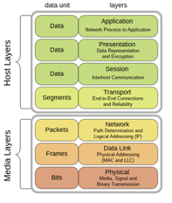

**Câu 1:** TCP/IP là gì?
- TCP/IP là một tập hợp các giao thức được sử dụng để truyền dữ liệu trên mạng máy tính. TCP/IP là mô hình mạng phổ biến nhất trên thế giới, được sử dụng trong hầu hết các mạng máy tính, bao gồm cả mạng cục bộ (LAN), mạng diện rộng (WAN) và internet.

**Câu 2:** OSI là gì?
- OSI là một mô hình mạng mô tả các chức năng cần thiết để truyền dữ liệu giữa hai máy tính. Mô hình OSI được chia thành 7 lớp, mỗi lớp thực hiện một chức năng cụ thể.

**Câu 3:** Hãy nêu các lớp của mô hình OSI.

- Lớp vật lý (Physical Layer): Chịu trách nhiệm cho việc truyền dữ liệu ở dạng bit trên môi trường truyền dẫn vật lý.
- Lớp liên kết dữ liệu (Data Link Layer): Chịu trách nhiệm cho việc truyền dữ liệu trong một khung dữ liệu.
- Lớp mạng (Network Layer): Chịu trách nhiệm cho việc định tuyến dữ liệu giữa các mạng.
- Lớp truyền vận (Transport Layer): Chịu trách nhiệm cho việc đảm bảo dữ liệu được truyền một cách đáng tin cậy.
- Lớp phiên (Session Layer): Chịu trách nhiệm cho việc thiết lập và quản lý phiên giao tiếp giữa hai máy tính.
- Lớp trình bày (Presentation Layer): Chịu trách nhiệm cho việc định dạng dữ liệu.
- Lớp ứng dụng (Application Layer): Cung cấp các dịch vụ cho các ứng dụng người dùng.

**Câu 4:** Hãy nêu các lớp của mô hình TCP/IP.

- Lớp ứng dụng (Application Layer): Cung cấp các dịch vụ cho các ứng dụng người dùng.
- Lớp vận chuyển (Transport Layer): Chịu trách nhiệm cho việc đảm bảo dữ liệu được truyền một cách đáng tin cậy.
- Lớp Internet (Internet Layer): Chịu trách nhiệm cho việc định tuyến dữ liệu giữa các mạng.
- Lớp liên kết dữ liệu (Link Layer): Chịu trách nhiệm cho việc truyền dữ liệu trong một khung dữ liệu.

**Câu 5:** Hãy nêu các chức năng của Physical layer trong mô hình OSI.

- Định nghĩa các đặc điểm vật lý của môi trường truyền dẫn(chân cắm (pin), hiệu điện thế, cáp nối (cable)…).
- Mã hóa và giải mã dữ liệu thành các bit.
- Truyền dữ liệu trên môi trường truyền dẫn.

**Câu 6:** Hãy nêu các chức năng của lớp Datalink trong mô hình OSI.

- Cung cấp một đường truyền dữ liệu đáng tin cậy cho lớp mạng.
- Phát hiện và sửa lỗi dữ liệu.
- Xác thực địa chỉ vật lý của máy tính.

**Câu 7:** Hãy nêu các chức năng của lớp Network trong mô hình OSI.

- Cung cấp các chức năng và quy trình cho việc truyền các chuỗi dữ liệu có độ dài đa dạng từ một nguồn tới một đích. 
- Tầng mạng thực hiện các chức năng định tuyến. 
- Các thiết bị định tuyến (router) hoạt động tại tầng này.

**Câu 8:** Hãy nêu các chức năng của lớp Transport trong mô hình OSI.

- Chuyển dữ liệu giữa các người dùng tại đầu cuối. Thực hiện chia các gói tin lớn thành các gói tin nhỏ hơn trước khi gửi đi và đánh số các gói tin để đảm bảo chúng gửi đúng thứ tự. Ví dụ ở giao thức tầng 4 là TCP hoặc UDP

- Transport Layer chịu trách nhiệm cho process-for-process trong một mạng chung.

`Tầng 5: Tầng Phiên (Session Layer)`
- Kiểm soát các phiên hội thoại giữa các máy tính, duy trì và đồng bộ phiên truyền thông giữa các máy. 
- Session Layer thường không được dùng trong bộ giao thức TCP/IP

`Tầng 6: Tầng trình diễn (Presentation layer)`
- Hoạt động như tầng dữ liệu trên mạng. Tầng này là nhiệm vụ dịch dữ liệu được gửi từ tầng ứng dụng sang một định dạng chung. Và ở máy tính nhận lại dịch từ định dạng chung sang định dạng của tầng ứng dụng. 
-	Dịch mã từ ASCII sang EBCDIC
-	Chuyển đổi dữ liệu (vd từ interger sang phẩy động)
-	Nén dữ liệu
-	Mã hoá

**Câu 9:** Hãy nêu các chức năng của lớp Application trong mô hình OSI.

- Nó cung cấp phương tiện cho người dùng truy cập các thông tin và dữ liệu trên mạng thông qua chương trình ứng dụng và tương tác. Ứng dụng ví dụ như: HTTP, Telnet, FTP…

**Câu 10:** Hãy nêu chức năng của DNS.
- Chức năng của DNS là chuyển đổi tên miền thành địa chỉ IP. DNS là một dịch vụ quan trọng trong mạng máy tính, giúp người dùng dễ dàng nhớ tên miền của một máy tính hơn là nhớ địa chỉ IP của máy tính đó.

**Câu hỏi 11:** Hãy nêu các loại giao thức TCP/IP.
- Giao thức vận chuyển: TCP, UDP
- Giao thức mạng: IP, ICMP, IGMP
- Giao thức liên kết dữ liệu: Ethernet, PPP, SLIP
- Giao thức vật lý: Ethernet, Token Ring, FDDI

**Câu hỏi 12:** Hãy nêu các loại địa chỉ IP.

- Địa chỉ IP lớp A: 1.0.0.0 đến 126.255.255.255
- Địa chỉ IP lớp B: 128.0.0.0 đến 191.255.255.255
- Địa chỉ IP lớp C: 192.0.0.0 đến 223.255.255.255
- Địa chỉ IP lớp D: 224.0.0.0 đến 239.255.2

**Câu hỏi 13:** Các loại mạng TCP/IP là:

* Mạng cục bộ (LAN): Mạng máy tính được nối với nhau trong một phạm vi nhỏ, chẳng hạn như trong một tòa nhà hoặc một khu vực.
* Mạng diện rộng (WAN): Mạng máy tính được nối với nhau trong một phạm vi rộng, chẳng hạn như trên toàn quốc hoặc toàn cầu.
* Mạng không dây: Mạng máy tính được nối với nhau bằng sóng radio.
* Mạng di động: Mạng máy tính được nối với nhau bằng thiết bị di động, chẳng hạn như điện thoại thông minh hoặc máy tính bảng.

**Câu hỏi 14:** Các loại lỗi trong mô hình OSI là:

* Lỗi bit: Lỗi xảy ra khi một bit dữ liệu bị thay đổi hoặc bị mất.
* Lỗi khung: Lỗi xảy ra khi một khung dữ liệu bị hư hỏng hoặc bị mất.
* Lỗi gói: Lỗi xảy ra khi một gói dữ liệu bị hư hỏng hoặc bị mất.

**Câu hỏi 15:** Các phương pháp giải quyết lỗi trong mô hình OSI là:

* Phát hiện lỗi: Phương pháp này phát hiện lỗi bằng cách `so sánh dữ liệu truyền đi với dữ liệu nhận được`.
* Sửa lỗi: Phương pháp này sửa lỗi bằng cách sử dụng các kỹ thuật như `mã hóa lỗi và kiểm tra chẵn lẻ`.

**Câu hỏi 16:** Các loại miền DNS là:

* Miền gốc (Root Domain): Miền gốc là miền ở cấp cao nhất trong hệ thống phân cấp DNS.
* Miền cấp cao nhất (Top-Level Domain): Miền cấp cao nhất là miền ở cấp thứ hai trong hệ thống phân cấp DNS.
* Miền cấp hai (Second-Level Domain): Miền cấp hai là miền ở cấp thứ ba trong hệ thống phân cấp DNS.
* Miền cấp ba (Third-Level Domain): Miền cấp ba là miền ở cấp thứ tư trong hệ thống phân cấp DNS.

**Câu hỏi 17:** Các loại máy chủ DNS là:

* Máy chủ DNS gốc: Máy chủ DNS gốc là máy chủ DNS ở cấp cao nhất trong hệ thống phân cấp DNS.
* Máy chủ DNS cấp cao nhất (TLD): Máy chủ DNS cấp cao nhất là máy chủ DNS ở cấp thứ hai trong hệ thống phân cấp DNS.
* Máy chủ DNS cấp hai (SLD): Máy chủ DNS cấp hai là máy chủ DNS ở cấp thứ ba trong hệ thống phân cấp DNS.
* Máy chủ DNS cấp ba (TLD): Máy chủ DNS cấp ba là máy chủ DNS ở cấp thứ tư trong hệ thống phân cấp DNS.

**Câu hỏi 18:** Các loại bản ghi DNS là:

* Bản ghi A: Bản ghi A ánh xạ tên miền thành địa chỉ IP.
* Bản ghi AAAA: Bản ghi AAAA ánh xạ tên miền thành địa chỉ IPv6.
* Bản ghi CNAME: Bản ghi CNAME ánh xạ tên miền thành một tên miền khác.
* Bản ghi MX: Bản ghi MX ánh xạ tên miền thành máy chủ thư.
* Bản ghi NS: Bản ghi NS ánh xạ tên miền thành máy chủ tên.
* Bản ghi SOA: Bản ghi SOA là bản ghi gốc của miền.

**Câu hỏi 19:** Các nguyên tắc thiết kế DNS là:

* Tính phân cấp: DNS được thiết kế theo mô hình phân cấp, với các miền được tổ chức thành một cây.
* Tính phân tán: DNS được phân tán trên nhiều máy chủ DNS, giúp tăng cường tính khả dụng và hiệu suất.
* Tính tin cậy: DNS được thiết kế để đảm bảo tính tin cậy của dữ liệu.

**Câu hỏi 20:** Các vấn đề bảo mật liên quan đến DNS là:

* Tấn công Man-in-the-Middle: Tấn công này có thể được sử dụng để thay đổi các bản ghi DNS, dẫn đến việc người dùng truy cập vào các trang web giả mạo.
* Tấn công DNS cache poisoning: Tấn công này có thể được sử dụng để thay đổi các bản ghi DNS được lưu trữ trong bộ nhớ đệm của máy chủ DNS, dẫn đến việc người dùng truy cập vào các trang web giả mạo.
* Tấn công DNS spoofing: Tấn công này có thể được sử dụng để gửi các yêu cầu DNS giả mạo đến máy chủ DNS, dẫn đến việc người dùng truy cập vào các trang web giả mạo.

