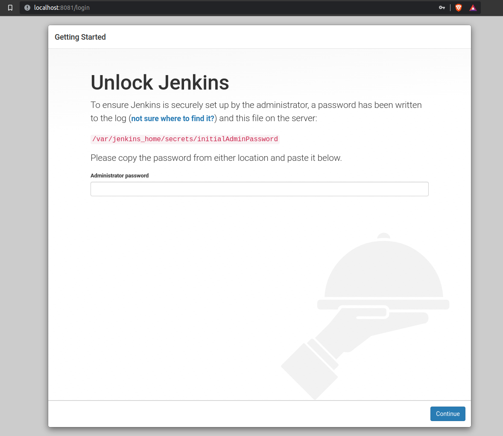
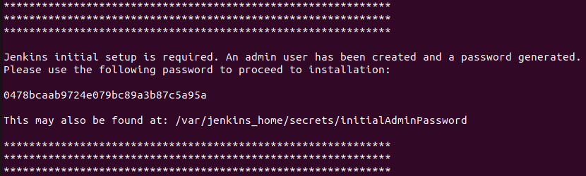
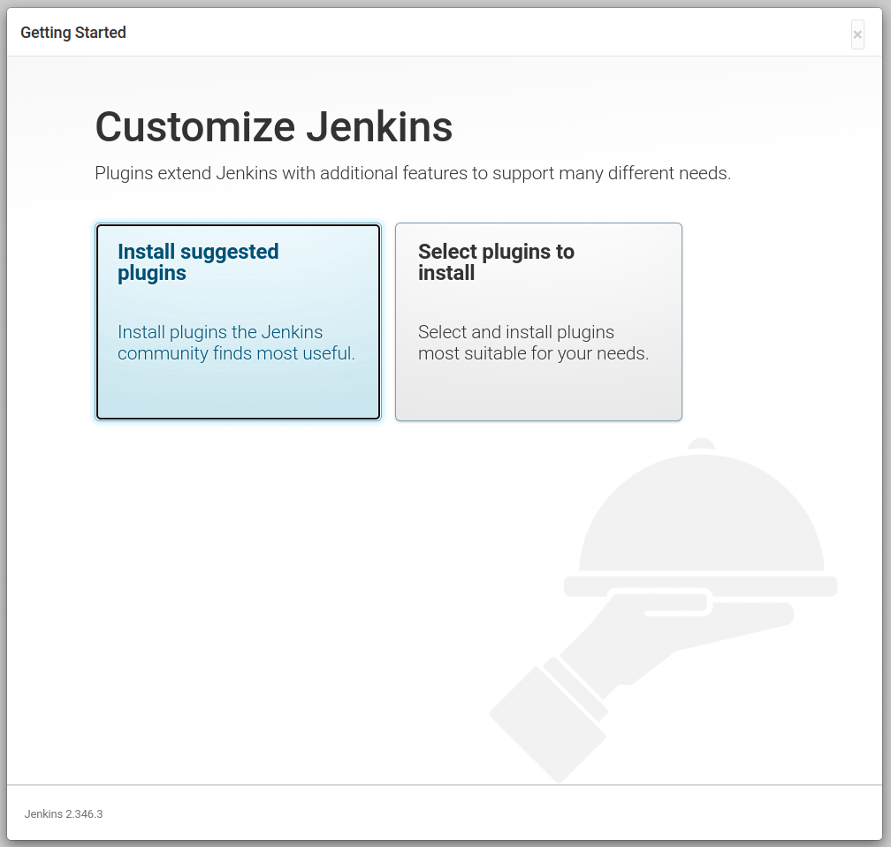
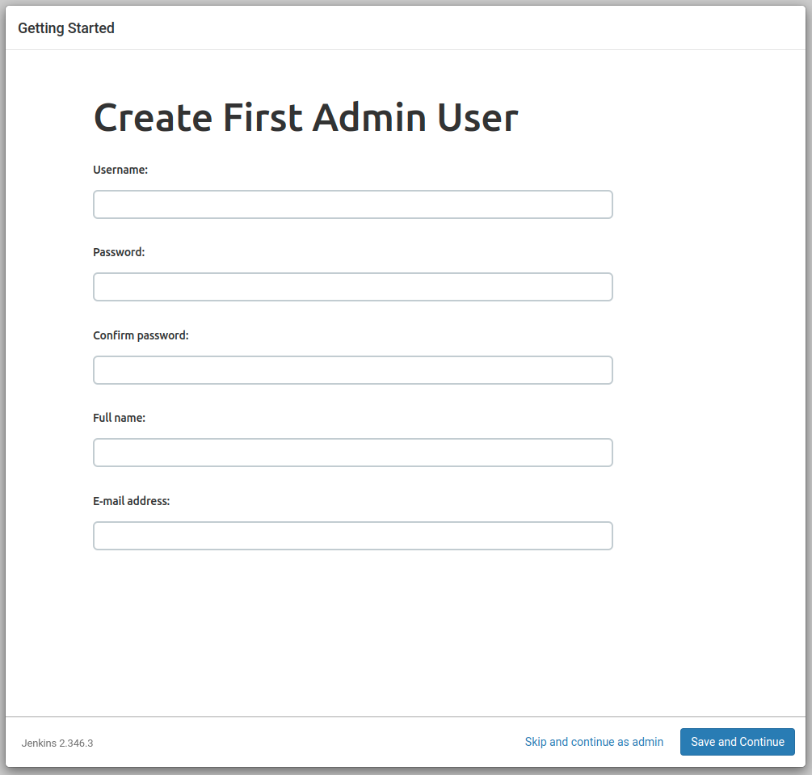
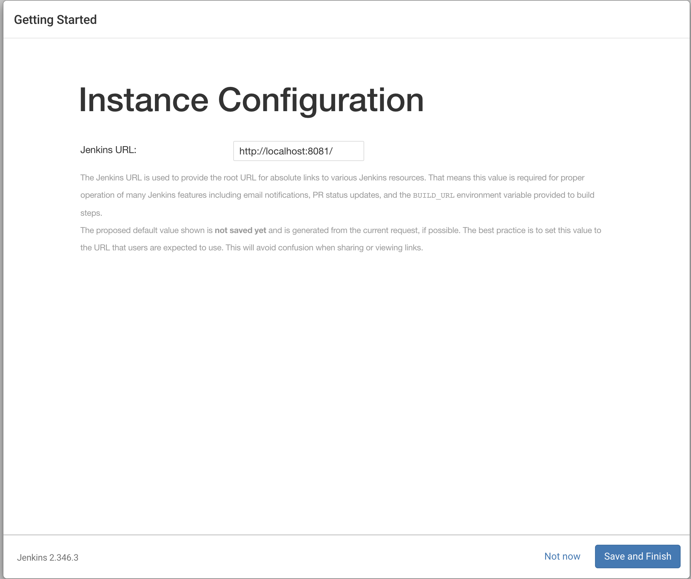
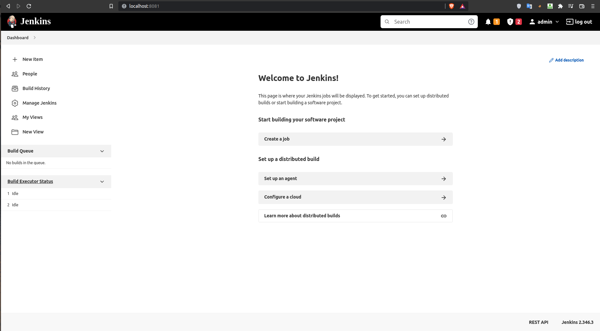
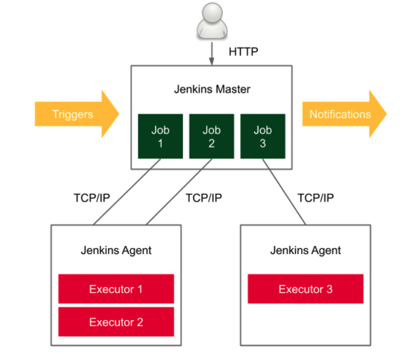

Table of Contents

Preface
Acknowledgments

## 1. Introduction to Jenkins
    1.1 What is Jenkins?
    1.2 The Importance of Continuous Integration and Continuous Delivery (CI/CD)
    1.3 Overview of Jenkins Features
    1.4 History of Jenkins

## 2. Getting Started with Jenkins
    2.1 Installing Jenkins
        2.1.1 Prerequisites
        2.1.2 Installation on Various Platforms (Windows, macOS, Linux)

ó 2 cách để cài đặt Jenkins: Docker container và Jenkins-server

# So Sánh Cài Đặt Jenkins Trực Tiếp và Chạy Jenkins dưới dạng Container

| Tiêu Chí                   | Cài Đặt Trực Tiếp Trên Máy Linux                          | Chạy Jenkins dưới dạng Container                           |
|----------------------------|------------------------------------------------------------|-------------------------------------------------------------|
| **Ưu Điểm**               | - Kiểm soát trực tiếp trên hệ thống.<br>- Tối ưu hóa tài nguyên dành riêng cho Jenkins.<br>- Được hỗ trợ bởi cộng đồng Jenkins lớn. | - Triển khai nhanh chóng và dễ dàng.<br>- Môi trường nhất quán giữa các máy chủ và các môi trường phát triển.<br>- Dễ dàng nâng cấp và tái cấu hình.<br>- Tận dụng lợi thế của quản lý container Docker. |
| **Nhược Điểm**            | - Cài đặt và cấu hình ban đầu có thể phức tạp.<br>- Khó di chuyển hoặc tái tạo môi trường.<br>- Cần quản lý phụ thuộc hệ thống cẩn thận. | - Cần kiến thức về Docker và quản lý container.<br>- Có thể gặp phải vấn đề về hiệu suất nếu không được cấu hình đúng cách.<br>- Phụ thuộc vào nền tảng Docker. |
| **Trường Hợp Sử Dụng**    | - Thích hợp với các tổ chức có yêu cầu cao về bảo mật và kiểm soát hệ thống.<br>- Khi cần tích hợp sâu với hệ thống OS và phần cứng cụ thể.<br>- Các môi trường sản xuất lớn với cấu hình phức tạp. | - Phát triển nhanh, thử nghiệm, và môi trường giáo dục.<br>- Các dự án yêu cầu sự linh hoạt và khả năng mở rộng nhanh.<br>- Khi cần triển khai nhiều instance Jenkins cho các môi trường phát triển, kiểm thử và staging. |
| **Cài Đặt & Cấu Hình**     | - Cần cài đặt Java JDK.<br>- Tải và cài đặt Jenkins từ kho lưu trữ hoặc từ source.<br>- Cấu hình thủ công các file và service. | - Tải hình ảnh Jenkins từ Docker Hub.<br>- Sử dụng Dockerfile hoặc docker-compose.yml để cấu hình.<br>- Dễ dàng sao chép và phân phối cấu hình. |
| **Bảo Mật**                | - Cần theo dõi và cập nhật hệ thống OS và Jenkins.<br>- Các cấu hình bảo mật cần được áp dụng một cách thủ công. | - Cách ly tốt hơn do chạy trong container.<br>- Dễ dàng cập nhật hình ảnh container để vá lỗ hổng. |
| **Tích Hợp**               | - Tích hợp sâu với các công cụ và dịch vụ trên máy chủ.<br>- Có thể sử dụng các plugin hệ thống cụ thể. | - Cần cấu hình mạng và lưu trữ để tích hợp với các dịch vụ bên ngoài.<br>- Một số plugin có thể không hoạt động ổn định trong môi trường container. |
| **Khả Năng Mở Rộng & Phục Hồi** | - Khả năng mở rộng giới hạn bởi phần cứng.<br>- Phục hồi sau sự cố có thể phức tạp và mất thời gian. | - Dễ dàng mở rộng bằng cách thêm container.<br>- Phục hồi nhanh từ snapshot và volume của Docker. |
| **Quản Lý Phiên Bản**      | - Quản lý thủ công phiên bản của Jenkins và các phụ thuộc.<br>- Cần phải theo dõi cập nhật từ cộng đồng. | - Quản lý phiên bản đơn giản thông qua các tag hình ảnh Docker.<br>- Cập nhật tự động và quản lý dễ dàng với các công cụ quản lý container. |
| **Tài Nguyên & Hiệu Suất** | - Tối ưu hóa tài nguyên cho Jenkins.<br>- Có thể tinh chỉnh để đạt hiệu suất cao nhất. | - Có thể gặp phải overhead từ Docker nếu tài nguyên không được quản lý đúng cách.<br>- Hiệu suất có thể biến động tùy thuộc vào cấu hình container. |

Thông qua bảng so sánh này, người đọc có thể hiểu rõ hơn về các lựa chọn khi cài đặt Jenkins và chọn phương pháp phù hợp nhất với yêu cầu cụ thể của họ.


### Cài đặt Jenkins với Docker

#### Source: https://dev.to/andresfmoya/install-jenkins-using-docker-compose-4cab

Yêu cầu: Docker, Docker Compose đã được cài đặt.

File docker compose: `jenkins-docker-compose.yaml`

```yaml
version: '3.7'
services: 
  jenkins: # Đinh nghĩa dịch vụ
    image: jenkins/jenkins:lts 
    privileged: true # cho phép container có những quyền tương tự như quyền của root trên máy chủ, Jenkins bên trong container có khả năng quản lý Docker.
    user: root # có thể thực hiện các tác vụ cần quyền quản trị như cài đặt các gói bên trong container hoặc quản lý Docker.
    ports:
      - 8081:8080 # 8081 (machine) <- 8080 (container)
      - 50000:50000 # được sử dụng để kết nối các Jenkins agent
    container_name: jenkins
    volumes:
      - ./run_env/jenkins_home:/var/jenkins_home
      - /var/run/docker.sock:/var/run/docker.sock
      - /usr/bin/docker:/usr/bin/docker
      - /usr/local/bin/docker-compose:/usr/bin/docker-compose
```
- `./run_env/jenkins_home:/var/jenkins_home`: Thư mục jenkins_home trong container (nơi lưu trữ dữ liệu và cấu hình của Jenkins) sẽ được lưu trữ tại .`/run_env/jenkins_home` trên máy chủ để dữ liệu không bị mất khi container bị xóa.
- `/var/run/docker.sock:/var/run/docker.sock`: Socket của Docker được ánh xạ từ máy chủ vào container, cho phép Jenkins quản lý các container Docker.
- `/usr/bin/docker:/usr/bin/docker` và `/usr/local/bin/docker-compose:/usr/bin/docker-compose`: Ánh xạ Docker và Docker Compose từ máy chủ vào container, cho phép sử dụng chúng trong container.

```sh
docker compose -f 'jenkins-docker-compose.yaml' up -d
```

    2.2 Navigating the Jenkins Interface

Truy cập http://localhost:8081



Checklog to get Password:
```sh
docker logs jenkins
```



    2.3 Configuring Your Jenkins Server

Chọn Install suggested plugins và chờ Jenkins cài đặt các plugins.


Ở giao diện đăng ký user sử dụng Jenkins chọn Skip and continue as admin.

Trong thực tế, người quản trị Jenkins sẽ phải tạo user và cấp quyền phù hợp. Ở đây chúng ta sử dụng tài khoản admin để tránh đi quá sâu vào phần quản trị này.


Cấu hình Jenkins URL như sau:





    2.4 Setting Up Your First Project

## 3. Core Jenkins Concepts
    3.1 Jobs and Builds
    3.2 Plugins
    3.3 Executors and Nodes
    3.4 Workspaces and Build Artifacts
    3.5 Source Code Management Integration

## 4. Building with Jenkins
    4.1 Setting Up Build Triggers
    4.2 Understanding Build Steps
    4.3 Testing with Jenkins
    4.4 Post-build Actions
    4.5 Notifications

## 5. Advanced Jenkins Features
    5.1 Pipeline as Code
        5.1.1 Declarative vs. Scripted Pipelines
        5.1.2 Jenkinsfile
    5.2 Managing Users and Security
    5.3 Environment Variables and Parameters
    5.4 Distributed Builds

## 6. Managing Plugins
    6.1 Finding and Installing Plugins
    6.2 Plugin Configuration
    6.3 Commonly Used Plugins
    6.4 Updating and Maintaining Plugins

## 7. Jenkins Pipeline Deep Dive
    7.1 Defining Multibranch Pipelines
    7.2 Working with Shared Libraries
    7.3 Visualization and Reporting

## 8. Integrating Jenkins with Other Tools
    8.1 Integration with Version Control Systems
    8.2 Code Quality and Analysis Tools
    8.3 Containerization and Orchestration with Docker and Kubernetes
    8.4 Deployment and Monitoring Tools

## 9. Scaling Jenkins
    9.1 Master-Agent Architecture
Jenkins dễ dàng bị overload, do đó xây dựng kiến trúc master-agents sẽ giúp tính HA được cao hơn.

Jenkins server được gọi là Master, và nó có thể gán các nhiệm vụ thực thi cho các Jenkins Agents.



Jenkins master chịu trách nhiệm:

        - Tiếp nhận các build triggers
        - Gửi noti
        - Handling HTTP requests
        - Quản lý môi trường build.


    9.2 Scaling Jenkins with Cloud Resources


    9.3 High-Availability Configurations

## 10. Best Practices
    10.1 Job Configuration Best Practices
    10.2 Securely Managing Credentials
    10.3 Backup and Disaster Recovery
    10.4 Performance Tuning

## 11. Case Studies
    11.1 Small and Medium Enterprise Use Cases
    11.2 Large-Scale Jenkins Deployments

## 12. The Future of Jenkins and Continuous Integration

Appendix A: Resources for Further Learning
Appendix B: Troubleshooting Common Jenkins Issues
Appendix C: Glossary of Terms

Index


