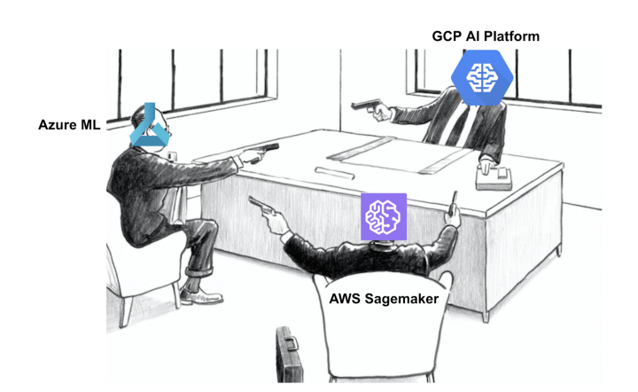
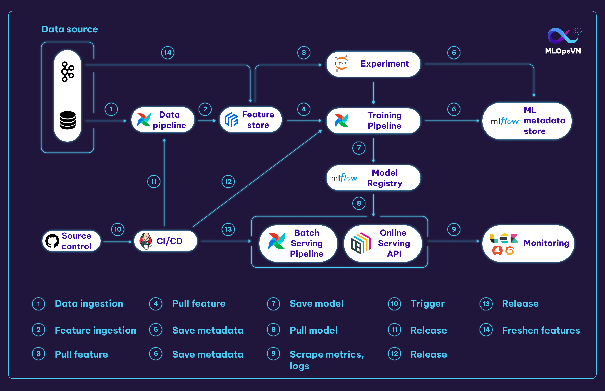
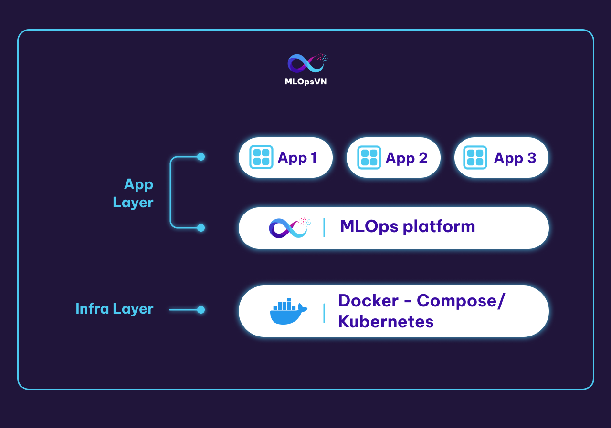

MLOps Platform là nền tảng cung cấp các công cụ cần thiết để phát triển, thử nghiệm, triển khai các dự án ML.

|Tên thành phần|Ý nghĩa|Tool|
|--------------|-------|----|
|Source control|Quản lý phiên bản của code|Git & Github|
|Feature store|Lưu trữ, quản lý và tương tác với các tính năng|Feast (PostgreSQL & Redis backend)|
|Experiment tracking|Lưu trữ thông tin và quản lý các thí nghiệm|MLFlow|
|Model Registry|Lưu trữ và quản lý các model|MLFlow|
|ML metadata Store|Lưu trữ thông tin (artifact) của các luồng (pipeline)|MLFlow|
|Workflow orchestrator|Xây dựng và quản lý các luồng quy trình|Airflow|
|Monitoring & Logging|Theo dõi tài nguyên hệ thống, hiệu năng của mô hình và chất lượng dữ liệu trên production|Prometheus, Grafana, ELF stack|

- 1. Data Pipeline kéo và xử lý dữ liệu từ file source
- 2. Dữ liệu sau khi xử lý bởi Data Pipeline sẽ được đẩy vào Feature Store
- 3. Data Scientist (DS) kéo feature từ Feature Store để thực hiện các thí nghiệm trên notebook
- 4. Training Pipeline kéo feature về để train model
- 5. Metadata của các experiment, ví dụ như hyperparameters và metrics, ... được lưu vào Metadata Store (MLFlow)
- 7. Model sau khi train sẽ được lưu trữ ở Model Registry
- 8. Batch Serving Pipeline và Online Serving API kéo model từ Model Registry về để serving
- 9. Logs và metrics được scrape từ Online Serving API.
- 10. 11. 12. 13. DS push code lên Github kích hoạt triển khai tự động (CI/CD) cho các pipelines và Online Serving API
- 14. Ngoài data source ở dạng tĩnh (static data), streaming data từ Kafka sẽ ghi liên tục vào Feature Store để cập nhật feature.

Tài liệu tham khảo:khảo

- https://ml-ops.org/content/end-to-end-ml-workflow
- https://valohai.com/mlops-platforms-compared/
- https://cloud.google.com/architecture/mlops-continuous-delivery-and-automation-pipelines-in-machine-learning

