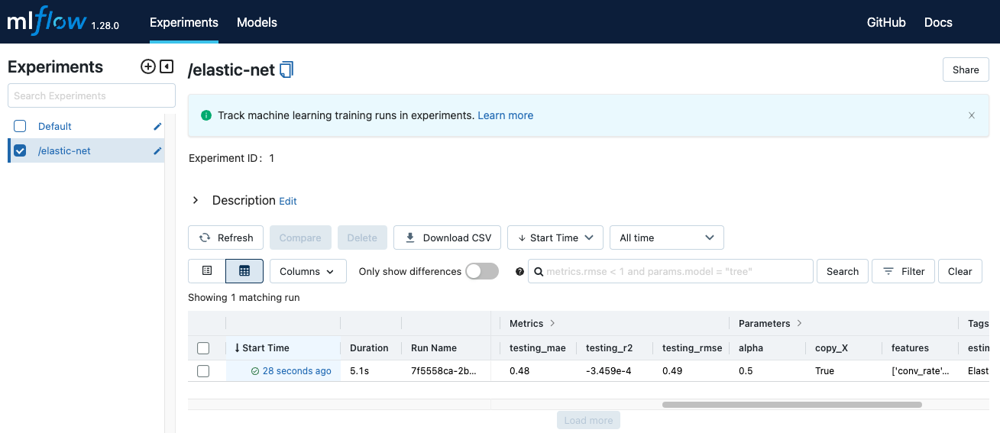

## POC

POC thử nghiệm các giải pháp nhanh chóng để chứng minh tồn tại ít nhất một giải pháp khả thi có thể giải quyết được vấn đề kinh doanh.


|Câu hỏi|Trả lời|
|-------|-------|
|Data được lấy từ đâu?|Tổng hợp bởi DE|
|Data được biến đổi và lưu trữ thế nào ?|Được DE xử lý để thực hiện POC trước, format là `parquet`, tạm thời lưu ở Database nội bộ của công ty.|
|Future tiềm năng ?|`conv_rate`, `acc_rate`, `avg_daily_trips`|
|Model architecture tiềm năng?|Elastic Net|
|Metrics nào để đánh giá model?|MSE, RMSE, R2|

### Các câu hỏi quan trọng

#### Thế nào là một dự án POC thành công?

Ở những dự án POC đầu tiên, ML model chưa được triển khai ra production mà chỉ được thử nghiệm offline. Do đó, chúng ta cần sử dụng các offline metrics để đánh giá. Cụ thể, cần đặt một threshold cho các metrics này. Ví dụ, sử dụng metric RMSE với một hạn mức (threshold) để định nghĩa dự án POC thành công là RMSE phải nhỏ hơn 0.5.

Ngoài RMSE cho bài toán logistic regression ra, một số metric khác cũng được sử dụng như:

- Sử dụng Accuracy, F1, AUC để đánh giá model performance cho bài toán classification
- Sử dụng thời gian training và inference của ML model để so sánh chi phí và lợi ích
- v.v.

#### Thu thập Data

Do pipeline data chưa hoàn thiện nên data dùng để thử nghiệm được DE thu thập từ data sources rồi chuyển giao data thô này cho Data scientist. DS sẽ thực hiện:
- Phân tích để định nghĩa cách biến đổi cho data từ đó xây dựng pipeline.
- Future engineẻing
- Thử nghiệm model architecture và hyperparameter.

#### Phân tích data

Trong phần này, Jupyter Notebook được dùng để viết code phân tích data và training code. Giả sử Data Engineering đã thu thập data từ data sources.

Tiếp theo, Data Scientist sẽ phân tích data để hiểu data. Quá trình này thường kiểm tra những thứ sau.

- Có feature nào chứa null không? Nên thay null bằng giá trị nào?
- Có feature nào có data không thống nhất không? Ví dụ: khác đơn vị (km/h, m/s), v.v
- Có feature hay label nào bị bias không? Nếu có thì do quá trình sampling hay do data quá cũ? Giải quyết thế nào?
- Các feature có tương quan không? Nếu có thì có cần loại bỏ feature nào không?
- Data có outlier nào không? Nếu có thì có nên xoá bỏ không?
- v.v

Mỗi vấn đề về Data sẽ có một cáhc giải quyết, tuy nhiêm sẽ không biết được cáhc giải quyết có hiệu quả hay không. Do vậy, tỏng quá trình kiểm tra và phân tích data thường sẽ đi kèm với các thử nghiệm model. Các metrics khi đánh giá model sẽ giúp xem giải pháp được thực hiện trên data là hiệu quả hay không.

Vì tiến trình bình thường của ML là thử nghiệm với data, model nên bước phân tích data này là bước trainning model như một vòng lặp được thực hiện lặp lại nhiều lần.

#### Training

Sau khi tổng hợp Features và labels vào DataFrame, chia thành training set và validation set.

Chúng ta cần thử nghiệm nhiều bộ feature, nhiều model architecture với các bộ hyperparameters khác nhau, do vậy để có thể tái lập kết quả traning cần phải có được log của các lần thử nghiệm. MLFlow sẽ đóng vai trò lưu trữ các thông tin của các lần thử nghiệm với ML metadata.


#### Theo dõi và thử nghiệm

MLFlow là một open-source platform để quản lý vòng đời và các quy tình trong một hệ thống ML. Một trong những chức năng của MLFlow là metadata store.


`mlops-crash-course-platform`


```sh
bash run.sh mlflow up 

# Đi tới http://localhost:5000/ để kiểm tra xem MLFlow server đã được khởi tạo chưa.

# Trong notebook training_pipeline/nbs/poc-integrate-mlflow.ipynb, đoạn code sau được thêm vào ở đoạn code training để tích hợp MLflow vào đoạn code training

MLFLOW_TRACKING_URI = "http://localhost:5000"
mlflow.set_tracking_uri(MLFLOW_TRACKING_URI)
mlflow.sklearn.autolog() 

# dòng này tự động quá trình log lại các hyperparameter và các metrics trong quá trình training 

# Đoạn code sau để log lại các hyperparameter và metric


mlflow.set_tag("mlflow.runName", uuid.uuid1()) # Đặt tên cho lần chạy


mlflow.log_param("features", selected_ft) # Log lại feature được dùng


mlflow.log_param("alpha", ALPHA) # Log lại hyperparameter

mlflow.log_param("l1_ratio", L1_RATIO)

mlflow.log_metric("testing_rmse", rmse) # Log lại metric sau khi test trên test set

mlflow.log_metric("testing_r2", r2)
mlflow.log_metric("testing_mae", mae)

mlflow.sklearn.log_model(model, "model") # Log lại model


```



#### Theo dõi features


Chúng ta đã coi bộ feature mà chúng ta sử dụng trong quá trình training như một hyperparameter và dùng MLflow để log lại. Tuy nhiên, đây chưa phải giải pháp tối ưu để theo dõi các feature trong quá trình thử nghiệm.

Mục đích của việc theo dõi các feature là để có thể tái lập kết quả của một thử nghiệm. Chỉ bằng việc lưu lại tên các feature được dùng thì không đảm bảo được sẽ tạo lại được kết quả, vì có thể feature bị đổi tên hoặc tên vẫn giữ nguyên nhưng cách biến đổi để sinh ra feature đó bị thay đổi. Do đó, việc theo dõi các feature này không chỉ là theo dõi tên của các feature, mà cả quy trình sinh ra các feature đó.

Ở giai đoạn POC, vì chưa có đủ nguồn lực để xây dựng cơ sở hạ tầng đủ mạnh để hỗ trợ việc theo dõi quy trình tạo ra feature, nên chúng ta chỉ kì vọng sẽ theo dõi được tên các feature là đủ. Trong các bài tiếp theo, chúng ta sẽ học cách theo dõi version của quy trình biến đổi feature và tích hợp version đó vào quá trình training.


## Enviroment

Môi trường phát triển được đặt tại `dev_requirements.txt`.

MLOps tools được sử dụng:

1. Jupyter notebook: thử nghiệm data, model
2. MLflow: ML Metadata Store, Model Registry.

